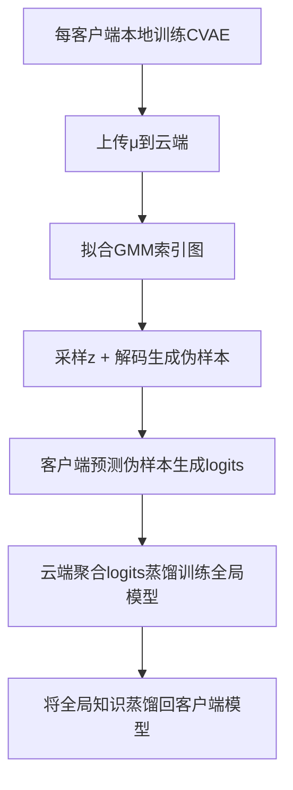

# FedBKD 方法详解与复现说明

本文件完整总结了《面向异质电磁信号调制识别的异构联邦学习方法研究》第三章提出的联邦蒸馏方法 FedBKD 的核心内容，包括方法定义、执行流程、数据集设置以及实验方案设计。并结合改写后的代码实现进行结构说明，适用于复现与调试参考。

---

## 📌 方法名称：FedBKD

FedBKD（Federated Bidirectional Knowledge Distillation）是一种面向**异构联邦电磁调制识别**场景设计的**无共享模型参数**的联邦蒸馏方法。其目标是在保留各客户端网络结构异构性的前提下，通过**伪样本驱动的蒸馏机制**进行全局知识融合与回传。

### 🎯 适用场景

- 客户端间模型结构不一致；
- 原始电磁数据无法上传；
- 数据分布高度异质；
- 注重通信开销、数据隐私。

---

## ✅ 方法结构与流程

FedBKD 包括三个关键组成：

### 1. **CVAE 训练阶段（每客户端独立）**

- 每个客户端使用本地数据训练自己的条件变分自编码器（CVAE）；
- 编码器输出隐变量 μ 用于拟合 GMM，生成**索引图**。

### 2. **GMM + 索引图生成阶段**

- 客户端本地将多个 μ 值上传；
- 云端拟合高斯混合模型（GMM）；
- 构建索引图：包括均值、协方差和类别权重。

### 3. **伪样本生成 + 双向蒸馏**

- 云端使用索引图采样隐变量 z；
- 使用解码器生成每类的伪调制样本；
- 客户端预测这些伪样本 → logits 平均 → 蒸馏训练全局模型；
- 再将全局模型的知识反向蒸馏到各客户端。

---

## 🔁 方法执行流程图



---

## 📂 数据集与预处理设置

### ✅ 数据集：RadioML2016.10a

- 包含11类调制类型，如：BPSK, QPSK, 8PSK, QAM16 等；
- 原始样本形状为 `2 × 128`（IQ信号）；
- 噪声环境：SNR 从 -20 dB 至 20 dB；
- 总样本数：约 2.5 万。
- 不使用AM-SSB数据集。只保留其余的 10 种调制类型,共 20 万个样本。然后对每个信  噪比下每种调制类型的 1000 个样本按照 3:1 的方式进行划分,750 个样本用于训练,  250 个样本用于测试。因此,训练集中共有 15 万个样本,测试集中共有 5 万个样本。
- 在所提算法的仿真实验中,设置 20  轮联邦训练,1 轮本地预热训练,初始学习率设置为 0.001,每经过 4 轮联邦训练,学  习率降低一半。需要说明的是,本章设置的每轮联邦过程中包含多次通信过程(即蒸  馏过程)。另外,通过 Adam 优化器来优化模型的分类损失和蒸馏损失,样本的批量  大小根据实验场景灵活设置。上、下行蒸馏过程中的温度参数 T1 和 T2 因数据集而  异,在 RadioML 2016.10a 数据集上 T1 设置为 4,T2 设置为 2;
- 在所提算法的性能验证过程中,主要进行了 2、3、5 个节点的  实验,所以为每个节点均匀划分了若干调制类型,来模拟数据异质情况,并设计了不同结构的模型,来模拟模型异构情况,

| 节点名称 | 对应模型 | RadioML 2016.10a 调制类型 | 要求识别类型                 |
| -------- | -------- | ------------------------- | ---------------------------- |
| 节点 1   | 模型 4   | 8PSK、AM-DSB              | 参与训练节点上的所有调制类型 |
| 节点 2   | 模型 1   | BPSK、CPFSK               | 参与训练节点上的所有调制类型 |
| 节点 3   | 模型 2   | GFSK、4PAM                | 参与训练节点上的所有调制类型 |
| 节点 4   | 模型 3   | 16QAM、64QAM              | 参与训练节点上的所有调制类型 |
| 节点 5   | 模型 5   | QPSK、WBFM                | 参与训练节点上的所有调制类型 |

| 模块名称 | 参数配置                                                                    | 全局 | 模型1 | 模型2 | 模型3 | 模型4 | 模型5 |
| -------- | --------------------------------------------------------------------------- | ---- | ----- | ----- | ----- | ----- | ----- |
| 通用块   | Conv_48, 15×2`<br>`Conv_64, 7×1, S=(2,1)                                | ✓   | ✓    | ✓    | ✓    | ✓    | ✓    |
| 自主块   | Conv_64, 3×1, S=(2,1)`<br>`Conv_128, 3×1`<br>`Conv_256, 3×1, S=(2,1) | ✓   | ✗    | ✗    | ✗    | ✓    | ✓    |
| 残差块1  | Conv_64, 3×1`<br>`Conv_64, 3×1                                          | ✓   | ✗    | ✗    | ✗    | ✓    | ✗    |
| 残差块2  | Conv_64, 3×1`<br>`Conv_64, 3×1                                          | ✓   | ✗    | ✗    | ✗    | ✓    | ✗    |
| 残差块3  | Conv_128, 3×1, S=(2,1)`<br>`Conv_128, 3×1                               | ✓   | ✗    | ✓    | ✓    | ✗    | ✓    |
| 残差块4  | Conv_128, 3×1`<br>`Conv_128, 3×1                                        | ✓   | ✗    | ✓    | ✓    | ✗    | ✓    |
| 残差块5  | Conv_256, 3×1`<br>`Conv_256, 3×1, S=(2,1)`<br>`Conv_256, 3×1         | ✓   | ✗    | ✓    | ✗    | ✓    | ✗    |
| 残差块6  | Conv_256, 3×1`<br>`Conv_256, 3×1`<br>`Conv_256, 3×1                  | ✓   | ✓    | ✓    | ✓    | ✓    | ✗    |
| 轻量块1  | Conv_64, 3×1, Dw, S=(2,1)`<br>`Conv_64, 1×1, Pw                         | ✓   | ✓    | ✗    | ✗    | ✗    | ✓    |
| 轻量块2  | Conv_128, 3×1, Dw, S=(2,1)`<br>`Conv_128, 1×1, Pw                       | ✓   | ✗    | ✓    | ✓    | ✗    | ✓    |
| 轻量块3  | Conv_256, 3×1, Dw, S=(2,1)`<br>`Conv_256, 1×1, Pw                       | ✓   | ✗    | ✓    | ✗    | ✓    | ✗    |
| 分类器   | AvgPooling`<br>`Fc × 128`<br>`Fc × 64`<br>`Fc × M                  | ✓   | ✓    | ✓    | ✓    | ✓    | ✓    |

### ✅ 预处理设置

- 每个客户端接收不同调制类别的数据（非独立同分布）；
- 所有数据统一归一化处理；
- 输入 reshape 为 `(1, 2, 128)` 以适配 CNN 模型。

---

### 🧪 实验步骤

1. 每个客户端使用本地数据训练 CVAE；
2. 每个客户端上传编码器输出的 μ 向量和标准差；
3. 云端拟合 GMM，生成索引图；
4. 云端生成伪调制样本；
5. 客户端预测伪样本 → 汇总 logits；
6. 云端进行蒸馏训练全局模型；
7. 云端向客户端下发蒸馏知识回传；
8. 重复执行若干轮后进行模型评估。

   先是客户端预热，每个客户端使用自己的真实本地数据；对各自模型进行若干轮正常训练（使用本地标签）；得到具有初步预测能力的客户端模型；然后进入联邦蒸馏流程：
   每个客户端在自身数据上训练一个变分自编码器（VAE）模型，然后将mean value 和standard deviation传给云端，云端拟合 GMM，生成索引图，云端生成伪调制样本，分发给客户端；客户端模型预测伪样本 → 上传 logits；云端蒸馏训练 global model；云端将伪样本 + global logits 分发；客户端：本地数据 + soft logits 联合训练；回到联邦蒸馏流程第 1 步。

---

## 📈 指标与可视化

- 使用平均准确率（Average Accuracy）评估全局模型；
- t-SNE 可视化特征分布；
- 混淆矩阵对比各调制类别识别效果；
- 曲线对比不同方法的训练过程。

---

## 🧩 代码说明与复现位置

关键模块及路径说明如下：

| 模块         | 路径                           |
| ------------ | ------------------------------ |
| CVAE结构定义 | `models/cvae.py`             |
| GMM索引图    | `models/gmm_index_map.py`    |
| 全局蒸馏逻辑 | `distill/client_to_cloud.py` |
| 客户端反蒸馏 | `distill/cloud_to_client.py` |
| 主流程       | `main.py`                    |

---

如需进一步集成图表、结果对比或增强代码组织结构，请联系维护人员或参考代码仓库说明。

## FedBKD方法详细流程

FedBKD方法整体流程可以划分为三个阶段，现对每一阶段进行逐步展开说明：

---

### 1. 伪调制信号生成（Pseudo Modulation Signal Generation）

**目标**：在保护隐私的前提下生成统一格式的调制信号，用作跨节点知识蒸馏的公共输入。

#### 1.1 本地VAE训练

每个客户端在自身数据上训练一个变分自编码器（VAE）模型，结构如下：

- 编码器：提取调制信号的隐含特征表示 \( z \)
- 解码器：重建原始信号 \( \hat{x} \)
- 先验分布：使用高斯混合模型（GMM）对潜在空间建模，替代标准正态分布

**损失函数**：
\[
\mathcal{L}_{VAE} = \mathbb{E}_{q(z|x)}[\log p(x|z)] - \beta \cdot D_{KL}[q(z|x) || p(z)]
\]

#### 1.2 潜变量变形机制

为了提高伪样本多样性，引入**变形等效结构（Deformation Equivalent Structure）**：

- 对潜变量 \( z \) 进行线性扰动 \( z' = Az + b \)，增强分布覆盖能力
- 避免生成样本陷入均值塌陷

#### 1.3 索引图机制（隐私保护）

每个节点使用私有索引图（Index Map）加密生成样本：

- 对伪样本中的标签或隐变量重新编号，使其他节点无法反推原始调制类型
- 保证参与方的数据不可逆溯

#### 1.4 伪样本集构建

- 每轮训练前生成统一格式伪样本集 \( X^{pseudo} \)
- 所有节点以相同顺序和数量构建伪样本

---

### 2. 上行全局集成蒸馏（Global Knowledge Aggregation）

**目标**：聚合所有客户端模型对伪样本的预测，生成权威“软标签”作为知识源。

#### 2.1 本地模型预测

- 每个客户端将 \( X^{pseudo} \) 输入其异构模型 \( f_k \)，得到预测分布：
  \[
  \hat{y}_k = f_k(X^{pseudo})
  \]
- 为增强蒸馏效果，使用温度参数 \( T > 1 \)：
  \[
  \hat{y}_k^{soft} = \text{Softmax}(f_k(X^{pseudo}) / T)
  \]

#### 2.2 上行上传

- 每个客户端将其预测概率 \( \hat{y}_k^{soft} \) 上传至服务器

#### 2.3 云端加权集成

- 服务器对所有客户端上传的结果进行加权融合，生成集成知识：
  \[
  \hat{y}^{agg} = \sum_k \alpha_k \cdot \hat{y}_k^{soft}
  \]
  其中 \( \alpha_k \) 为权重，可基于模型性能、历史精度、带宽等动态调整。
- 输出 \( \hat{y}^{agg} \) 为该轮的**伪标签知识库**，用于后续蒸馏。

---

### 3. 下行选择性异质蒸馏（Selective Local Distillation）

**目标**：客户端使用伪标签知识对本地模型进行蒸馏训练，实现异构结构间的知识迁移。

#### 3.1 蒸馏损失定义

- 每个客户端定义本地蒸馏损失函数（与本地数据监督训练损失联合）：
  \[
  \mathcal{L}_{total} = \mathcal{L}_{CE}(y, \hat{y}_{k}) + \lambda_k \cdot T^2 \cdot KL(\hat{y}^{agg} || \hat{y}_k^{soft})
  \]
  其中：
- \( \mathcal{L}_{CE} \)：真实标签交叉熵损失（有标签样本）
- \( KL \)：KL散度表示软标签蒸馏损失
- \( \lambda_k \)：控制蒸馏强度的权重，按节点结构复杂度/样本置信度自适应调整

#### 3.2 本地优化

- 使用上述损失进行本地模型权重更新（使用SGD/Adam等优化器）
- 每轮迭代完成后，保留优化后的模型用于下一轮伪样本评估

#### 3.3 模型保存与切换

- 若节点模型性能在本地验证集上下降，则回滚至上轮权重（防过拟合）
- 若性能提升则保留并继续优化

---

### 总体流程图（简述）

```text
       本地VAE         -> 生成伪样本X_pseudo
       本地模型        -> soft预测
                    => 上传至服务器
                       => 加权融合得伪标签Y_agg
                    <= 下发Y_agg
       本地模型        <- 蒸馏训练 <- Y_agg
       ↓更新本地模型
```
